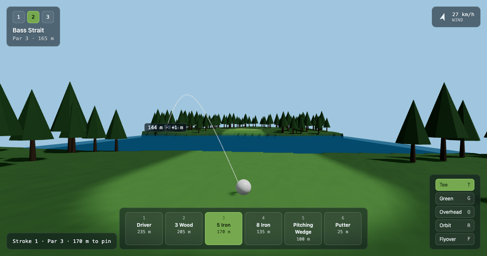

# Bellarine Links — 3D Golf Hole Explorer

[Live demo](https://golf-hole-explorer.vercel.app) · Built with React 19, three.js, React Three Fiber

A browser-based 3D golf hole visualiser. Three holes on a fictional coastal links course, with
pointer-based aiming, club selection, ballistic shot arcs and cinematic camera modes.

Every mesh, material and colour in the scene is generated in code — there are no model files,
textures or image assets in this repository.



## How it works

**Procedural terrain.** Each hole is defined by a centreline spline, a fairway width, a green
radius and a set of bunker and water polygons. A 201×201 vertex grid is built by hand into a
`BufferGeometry` — positions, normals and a custom `color` attribute written straight into typed
arrays, rather than displacing a `PlaneGeometry`. For every vertex, the horizontal distance to the
nearest point on the centreline drives a smoothstep between a flat fairway and increasingly noisy
rough, then polygon containment tests classify the surface and write per-vertex colours. One mesh,
one material, one draw call — no texture maps.

`buildTerrain` also returns two closures the rest of the app uses instead of raycasting:
`sampleHeight(x, z)`, a bilinear interpolation of the height grid, and `classify(x, z)`, which
decides whether a ball has finished in sand, water or grass.

**Shot arcs.** Ballistic arcs are parabolas fitted to the club's carry distance and launch angle —
apex `D·tan(θ)/4` — sampled into 48 points, with lateral wind drift applied along the shot normal.
Only the crosswind component displaces the ball, so a pure head or tail wind produces no drift.
Landing points are snapped to the terrain by bilinear interpolation of the height grid rather than
by raycasting. Pick a club that can't reach the cursor and the arc stops short, in amber, before
you commit to the shot.

**Instancing.** 400 candidate trees resolve to roughly 300 placements rendered in two draw calls
via `InstancedMesh` — one for trunks, one for canopies, sharing per-instance transforms. They are
scattered by rejection sampling against the surface classifier using a seeded PRNG, so positions
are stable across React re-renders.

**Cameras.** Five modes (Tee, Green, Overhead, Orbit, Flyover) share a single perspective camera.
Preset modes damp into position with a frame-rate-independent factor, `1 − pow(k, delta)`, rather
than a fixed lerp that would behave differently at 30 and 144 fps. `OrbitControls` is disabled
whenever a preset is driving the camera, because otherwise its writes and the `useFrame` writes
fight each other and the view jitters.

## Performance

Measured on an Apple M1 Pro at 2560×1440 in Chromium.

- **95 fps** · **15–19 draw calls** · **177k–180k triangles** · **383 kB gzipped**
- Terrain geometry built once per hole in **63–87 ms** and memoised — 40,401 vertices and
  80,000 triangles per hole
- **Zero geometry leaks:** `renderer.info.memory.geometries` holds flat across 30 hole switches,
  and across 120 cursor moves that each rebuild the preview arc
- **Zero camera jitter:** movement between consecutive frames measured at 0.00000 units once a
  preset has settled
- Zero allocations in the frame loop — scratch vectors live at module scope

## Running locally

Requires Node 22 or newer.

```bash
npm install
npm run dev
```

```bash
npm run build
```

## Notes

`DECISIONS.md` records where the implementation departed from its original spec and why — the
noise frequency chosen against the terrain grid's Nyquist limit, why water polygons are excluded
from the terrain bounds, and why a drag rather than any click hands the camera back to the user.
